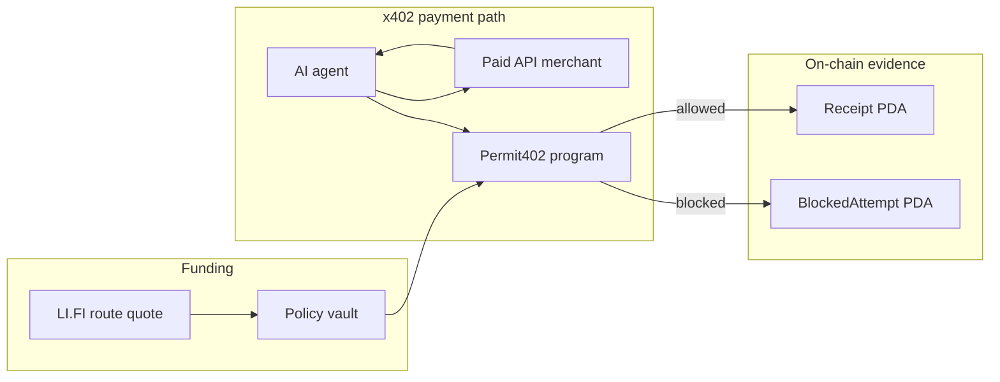
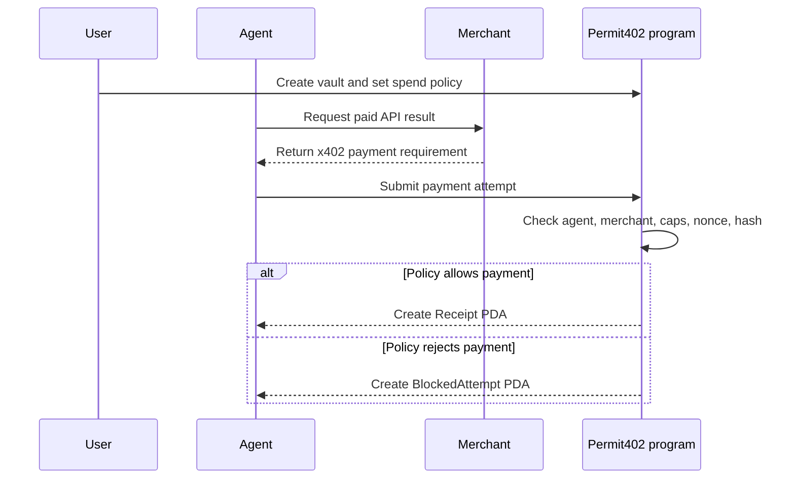

# Permit402

**Agents should not get wallets. They should get allowances.**

Permit402 is a Solana policy vault for autonomous x402 payments. Users fund a PDA-owned USDC vault, approve merchants, set spend limits, and let agents operate inside those boundaries. The agent can request a payment, but the Solana program decides whether that payment is allowed.

The result is a safer primitive for agent commerce: autonomous payments without handing an agent an open wallet.

Built for the Dev3pack Global Hackathon, May 8-10 2026.

## The Problem

x402 gives agents a clean way to pay for APIs and services. That unlocks useful workflows, but it creates a hard trust problem: once an agent can spend from a wallet, every prompt injection, malicious page, replayed request, or buggy tool call can become a real payment.

Most demos solve this in the UI. Permit402 solves it in the program.

## How It Works

Permit402 turns agent spend into an allowance system.

A user defines the policy once:

- which agent is allowed to act;
- which merchants are approved;
- how much can be spent per call;
- how much each merchant can receive;
- how much each category can consume;
- how much can be spent per day;
- when the policy expires.

Every payment attempt then follows the same path:

1. A merchant returns an x402 payment requirement.
2. The agent prepares a payment attempt for that exact request.
3. Permit402 checks the agent, merchant, amount, category, daily budget, expiry, nonce, and request hash.
4. Allowed payments create Receipt accounts.
5. Rejected attempts create BlockedAttempt accounts.

That means the demo is not just "an agent paid an API." The demo shows an agent trying to spend, and an on-chain policy deciding whether it is allowed.

## Architecture



## Payment Sequence



## Track Fit

| Track | Why Permit402 Fits |
|---|---|
| Solana Best App Overall | The Rust program is the product. It uses PDAs, SPL Token CPI, clock-based budgets, typed accounts, nonce replay protection, and auditable on-chain artifacts. |
| x402 Bonus on Solana | Permit402 adds the missing safety layer for x402 agent payments: policy-gated spend instead of direct wallet authority. |
| LI.FI Cross-Chain Solana UX | LI.FI provides the funding route into the Solana app. The current build verifies live Base USDC -> Solana USDC route quotes. |

## Devnet Program

| Item | Value |
|---|---|
| Program ID | `GiZNZ6kTa1R8Yypm7ub3zFpavCSpBxuxsHT5vHsM2L3S` |
| Solscan | https://solscan.io/account/GiZNZ6kTa1R8Yypm7ub3zFpavCSpBxuxsHT5vHsM2L3S?cluster=devnet |
| ProgramData | `AiTUcdVPjN5drLtUZgmneAjLuZxQK8NqpXCd2JTDM6px` |
| Upgrade authority | `CNsRQSWn25dWAjWKs2eqMPwugJD5EfGaB6mWbQGv78AT` |
| Last verified | 2026-05-10 with `solana program show ... --url devnet` |

The `GiZNZ...` program is verified on devnet, and the policy implementation is validated with Anchor tests.

## Policy Checks

The core `pay_x402` path enforces:

- approved `agent_authority`;
- merchant allowlist through `MerchantBinding`;
- per-call cap;
- per-merchant cap;
- category cap;
- total vault cap;
- daily cap with clock-based reset;
- policy expiry;
- replay protection through Receipt PDA collision;
- x402 request-hash binding.

Blocked attempts can be recorded with reason codes such as:

- `MerchantNotAllowed`;
- `ReceiptAlreadyExists`;
- `PerCallCapExceeded`;
- `PaymentRequestHashMismatch`;
- `PolicyExpired`;
- `UnauthorizedAgent`.

## Running the Demo

Start the local demo services:

```bash
pnpm --filter @permit402/merchants dev
pnpm --filter @permit402/facilitator dev
pnpm --filter @permit402/web dev
```

Then open:

```text
http://127.0.0.1:3000/demo
http://127.0.0.1:3000/fund
```

To run the local agent flow:

```bash
MERCHANT_BASE_URL=http://127.0.0.1:4021 pnpm --filter @permit402/agent demo
```

## Verification Checklist

| Area | Verification |
|---|---|
| Solana program | Devnet program verified at `GiZNZ6kTa1R8Yypm7ub3zFpavCSpBxuxsHT5vHsM2L3S` |
| Anchor policy logic | `anchor test --skip-build` passes with 14 tests |
| x402 support | Hosted facilitator reports Solana devnet exact support |
| LI.FI funding route | Live Base USDC -> Solana USDC routes return through the LI.FI SDK |
| Web app | Next.js demo and funding pages build successfully |
| Merchant loop | Merchant service verifies mock x402 payment signatures for the local demo flow |
| Shared package | Policy constants, block reasons, hash helpers, and Solscan helpers build and test cleanly |

## Repository Layout

```text
.
|-- Anchor.toml
|-- apps/
|   +-- web/                 # Next.js demo, funding page, read-only account adapter
|-- docs/
|   |-- permit402-plan.md    # locked product plan and demo script
|   |-- submission/          # evidence, QA, program addresses
|   +-- superpowers/plans/   # implementation and remaining-work plans
|-- packages/
|   +-- permit402-shared/    # categories, block reasons, hashes, Solscan helpers
|-- programs/
|   +-- permit402/           # Anchor/Rust policy vault program
|-- services/
|   |-- agent/               # mock-local demo agent
|   |-- facilitator/         # x402 support checker and preflight shim
|   |-- keeper/              # Permit402 memo helpers
|   +-- merchants/           # x402 challenge merchant endpoints
|-- tests/                   # Anchor integration tests
```

## Stack

```text
@coral-xyz/anchor@0.31.1
Solana / Anza CLI 2.1.21
platform-tools v1.52
@lifi/sdk@3.16.3
@lifi/widget@3.40.12
next@15.1.6
typescript@5.5.3
```

The x402 work is represented by local merchant, facilitator, keeper, and agent-demo services, plus a hosted-support check for Solana devnet exact payments.

## Quick Start

Install dependencies:

Prerequisites: Node 20, pnpm, Rust, Solana CLI, and Anchor 0.31.1.

```bash
pnpm install
```

Use Node 20, Solana active release, and cargo Anchor first in PATH:

```bash
export PATH="/opt/homebrew/opt/node@20/bin:$HOME/.local/share/solana/install/active_release/bin:$HOME/.cargo/bin:$PATH"
```

Build and test the program:

```bash
anchor build --no-idl -- --tools-version v1.52
anchor idl build -o target/idl/permit402.json -t target/types/permit402.ts
anchor test --skip-build
```

For the local UI and agent flow, see [Running the Demo](#running-the-demo).

## Frontend Environment

Mock mode runs without secrets.

For read-only localnet/devnet mode, set:

```bash
NEXT_PUBLIC_PERMIT402_MODE=mock
NEXT_PUBLIC_PERMIT402_PROGRAM_ID=GiZNZ6kTa1R8Yypm7ub3zFpavCSpBxuxsHT5vHsM2L3S
NEXT_PUBLIC_PERMIT402_POLICY=<policy-vault-pubkey>
NEXT_PUBLIC_SOLANA_RPC_URL=https://api.devnet.solana.com
```

Supported modes:

```text
mock | localnet | devnet
```

## Validation Commands

```bash
pnpm lint
pnpm --filter @permit402/shared build
pnpm --filter @permit402/shared typecheck
pnpm --filter @permit402/shared test
pnpm --filter @permit402/merchants smoke
pnpm --filter @permit402/facilitator smoke
pnpm --filter @permit402/facilitator x402:supported
pnpm --filter @permit402/keeper test
pnpm --filter @permit402/keeper typecheck
pnpm --filter @permit402/web lifi:quote
pnpm --filter @permit402/web typecheck
pnpm --filter @permit402/web build
anchor test --skip-build
```
